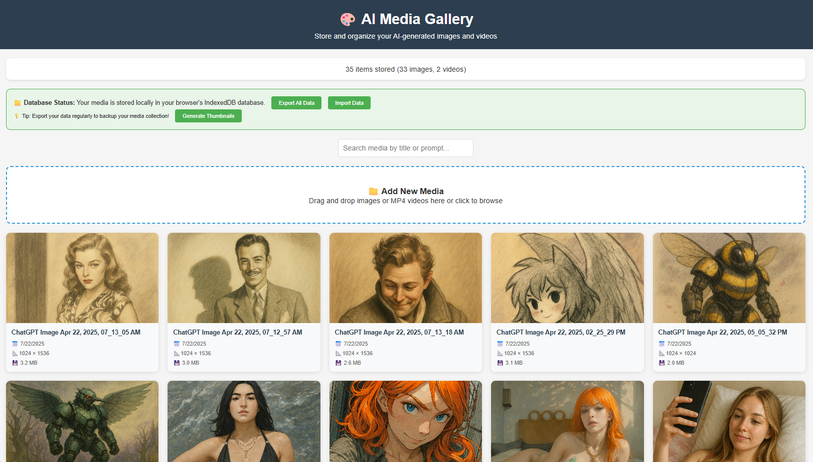

# ai-image-gallery

A web application designed for AI artists, providing a dedicated platform to store and manage their generated artwork efficiently.

**UPDATE 7-23-2025**
Database Refactoring: Moving to SQLite  We're actively refactoring the data layer, migrating from a browser-based database to SQLite. This move addresses limitations with the previous approach, offering improved data persistence, query performance, and offline capabilities.  SQLite provides a solid foundation for the next phase of development, with plans to evaluate and potentially migrate to a more scalable infrastructure like PostgreSQL in the future.

**UPDATE 7-24-2025**

## Application Architecture

The AI Media Gallery is a client-server web application built with:

- __Backend__: Node.js with Express.js framework
- __Database__: SQLite (using better-sqlite3)
- __Frontend__: Vanilla JavaScript with ES6 modules
- __Storage__: File system storage with database metadata

## Key Components

### Backend (server.js)

- REST API with endpoints for media management
- File upload handling with Multer
- SQLite database operations
- Static file serving

### Frontend Modules

1. __script.js__ - Main application entry point
2. __database.js__ - Server API client
3. __gallery.js__ - Gallery display and media card rendering
4. __mediaProcessor.js__ - File processing and metadata extraction
5. __modal.js__ - Media viewing/editing modal with Plyr integration
6. __metadata.js__ - Metadata organization and display
7. __thumbnailEditor.js__ - Thumbnail position editing
8. __thumbnailGenerator.js__ - Thumbnail generation
9. __utils.js__ - Utility functions
10. __updatePrompts.js__ - Prompt cleaning functionality
11. __Parser modules__ - Specialized metadata extraction for different AI tools

## Core Features

### Media Management

- Upload images/videos via drag-and-drop or file selection
- Automatic metadata extraction from PNG text chunks
- Video thumbnail generation from first frame
- Gallery display with responsive grid layout

### Metadata Handling

- Support for ComfyUI, ChatGPT, and AUTOMATIC1111 metadata formats
- Prompt extraction and cleaning
- Model information extraction
- Custom metadata editing

### User Interface

- Responsive design with mobile support
- Modal-based media viewing
- Plyr video player integration
- Thumbnail position editing with visual interface
- Search functionality

### Data Operations

- Export/import database functionality
- Bulk thumbnail generation
- Prompt updating/cleaning
- Media deletion with file cleanup

## Data Flow

1. User uploads media file
2. File is processed to extract AI metadata (prompts, models, etc.)
3. File is stored in server directories (images/videos by date)
4. Metadata is stored in SQLite database
5. Thumbnails are generated for videos
6. Media appears in gallery with searchable metadata
7. Users can view/edit metadata in modal interface
8. Changes are saved back to database

The application is well-architected with clear separation of concerns between frontend modules and follows modern JavaScript practices with ES6 modules.

